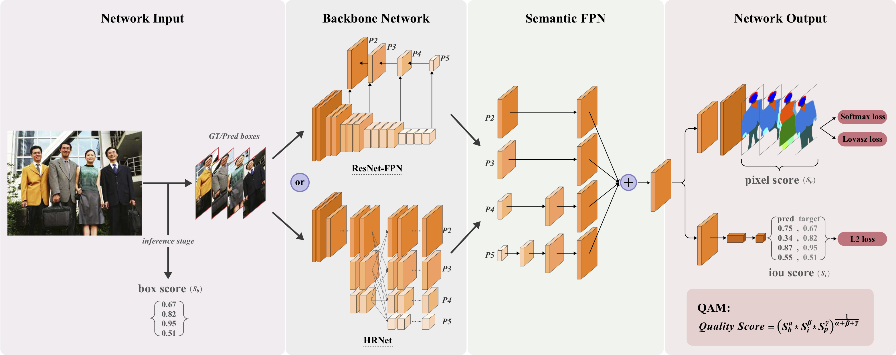

# News
- Pytorch official code of QANet is released. (03/11/2021)


# Introduction
Official implementation of **Quality-Aware Network for Human Parsing**

In this repository, we release the QANet code in Pytorch.

- QANet architecture:
<p align="center"></p>


## Citing QANet

If you use QANet, please use the following BibTeX entry.

```BibTeX
@inproceedings{yang2021qanet,
  title = {Quality-Aware Network for Human Parsing},
  author = {Lu Yang and Qing Song and Zhihui Wang and Zhiwei Liu and Songcen Xu and Zhihao Li},
  booktitle = {arXiv preprint arXiv:2103.05997},
  year = {2021}
}

```


## Installation

- 8 x TITAN RTX GPU
- pytorch1.6
- python3.6.8

Install QANet following [INSTALL.md](https://github.com/soeaver/QANet/blob/master/docs/INSTALL.md#install).


## Data Prepare

Please follow [DATA_PREPARE.md](https://github.com/soeaver/QANet/blob/master/docs/DATA_PREPARE.md#data_prepare) to download training and evaluating data.


## Results and Models

**QANet On CIHP**

|  Backbone  | mIoU | APp/APp50/PCP50 |  APr/APr50 | DOWNLOAD |
|:----------:|:----:|:---------------:|:----------:| :-------:|
|  ResNet50  | 62.9 | 60.1/74.3/68.9  | 56.2/63.5  | [GoogleDrive](https://drive.google.com/drive/folders/1DEqkkTKCbAvLXhJeoy2NC5CYZlr41Wak?usp=sharing) |        |
|  ResNet101 | 64.1 | 62.0/77.9/72.4  | 57.9/65.6  |          |
|  HRNet-W48 | 66.1 | 64.5/81.3/75.7  | 60.8/68.8  | [GoogleDrive](https://drive.google.com/drive/folders/145SAx0wTqu8y5JvW2L1TvVP5nczCt1_n?usp=sharing) |


**QANet On LIP**

|  Backbone  | Input Size | pixAcc. | meanAcc. | mIoU  | DOWNLOAD |
|:----------:|:----------:|:-------:|:--------:|:-----:| :-------:|
|  HRNet-W48 |   512×384  |  88.92  |   71.87  | 59.61 | [GoogleDrive](https://drive.google.com/drive/folders/1ASYmUvexB_j6Aiu4UaXbE3Bhw2F9QbSQ?usp=sharing) |
|  HRNet-W48 |   544×416  |  89.19  |   72.97  | 60.52 | [GoogleDrive](https://drive.google.com/drive/folders/1QRAhtuaDWDidxEoyBCf7wiHrUamKQUb_?usp=sharing) |


- Flip test is used.
- For CIHP, we use [FCOS-R50](https://drive.google.com/file/d/1_jA9sa2G_QKzFRgicQjZoL4gA51Fh6XJ/view?usp=sharing) to detect person (73.1 AP on CIHP val).
- Multi-scale test is used for LIP.


**ImageNet pretrained weights**

- [ResNet50](https://drive.google.com/file/d/1P-39VSDgZzm7YoTsS_WXzjDeB4kRTf-f/view?usp=sharing)
- [ResNet101](https://drive.google.com/file/d/15Un6LfPzQgRXDZRgPKiXmxbJ7hVOxzOp/view?usp=sharing)
- [HRNet-W48](https://drive.google.com/file/d/1gCqiQ9QIlVvanE-Res3hczvdrv4agsJc/view?usp=sharing)

please put the pretrained weights in `QANet/weights`


## Training

To train a model with 8 GPUs run:
```
python tools/train_net_all.py --cfg cfgs/CIHP/QANet/QANet_R-50c_512x384_1x.yaml
```


## Evaluation

### multi-gpu evaluation,
```
python tools/test_net_all.py --cfg ckpts/CIHP/QANet/QANet_R-50c_512x384_1x/QANet_R-50c_512x384_1x.yaml --gpu_id 0,1,2,3,4,5,6,7
```

### single-gpu evaluation,
```
python tools/test_net_all.py --cfg ckpts/CIHP/QANet/QANet_R-50c_512x384_1x/QANet_R-50c_512x384_1x.yaml --gpu_id 0
```


## License
QANet is released under the [MIT license](https://github.com/soeaver/QANet/blob/master/LICENSE).
